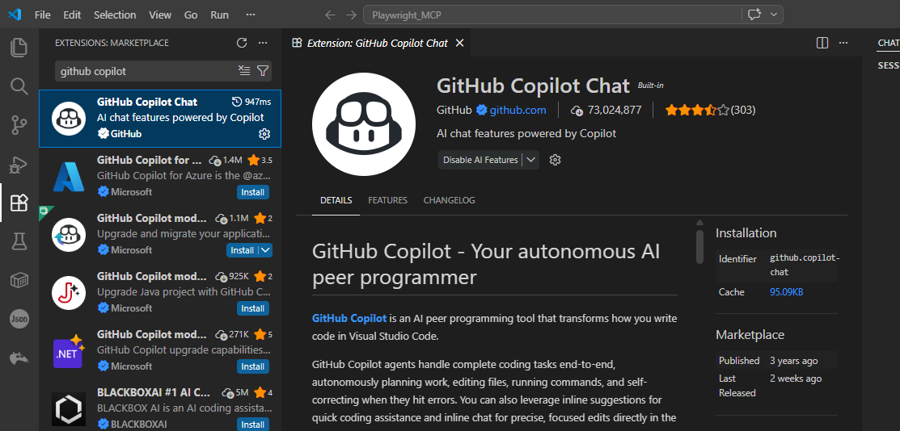
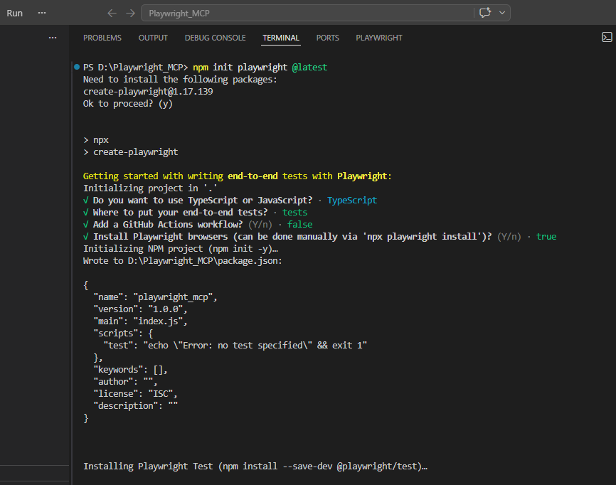
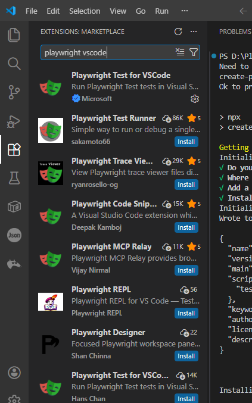
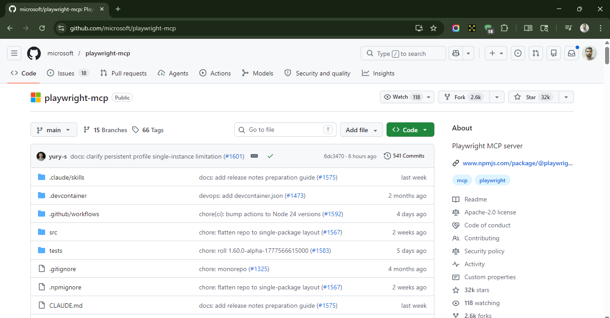
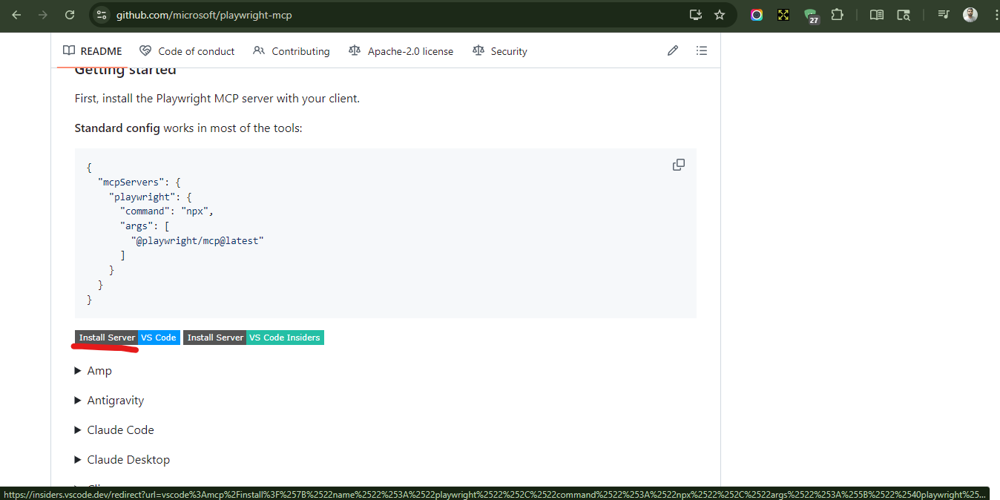
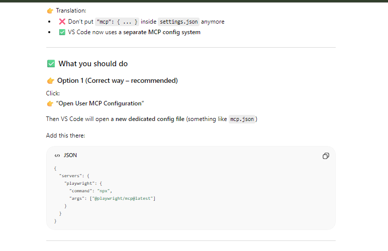

## AI-Powered Automation with Playwright MCP, GitHub Copilot and & VS Code

## AI Integration with Playwright

* AI is a big umbrella under which we have multiple domains - Robotics, Neural Networks, Data Science
* GenAI - It is basically generate the content based upon the knowledge it already have
* Tools - LLM, Agent, MCP
  * Popular LLMS - ChatGPT, Google Gemini, Claude, DeepSeek
  * LLM's can learn the things but cannot act/execute
* Prompting - Providing inputs/instructions to the LLM
* Agent - It is an assistant that actually does what the LLM says. It can perform actions(execution)

* How do we integrate LLM and agent?

Step 1 - 
1. Install GitHub copilot extension



Step 2 - 
* Install Playwright



Playwright VSCode extension(Optional)



Step 3 -  

Install Playwright MCP server



Click on Install server



Step 4 -  

* Ctrl + Shift + P
  * Preferences: Open User Settings (JSON) => Not anymore
  * Type - Open User MCP Configuration

Add this there - 

```json
{
  "servers": {
    "playwright": {
      "command": "npx",
      "args": ["@playwright/mcp@latest"]
    }
  }
}
```




* **Prompt**

```txt
you re a playwright test generator.'
you are given a scenario and you need to generate a playwright test for it.
DO NOT generate test code based on the scenario alone.
DO run steps one by one using the tools provided by the Playwright MCP.
Only after all steps are completed, emit a Playwright TypeScript test that uses
@playwright/test based on message history
save generated test file in the tests directory.
Execute the test file and iterate until the test passes.
```

To run the test cases - 

`npx playwright test --project=chromium --headed`

```txt
Open https://petstore.octoperf.com/actions/Catalog.action
Enter "fish" in search box
Click Search button
Verify "Angelfish" is present in results
```